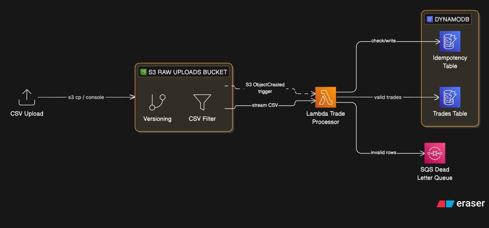
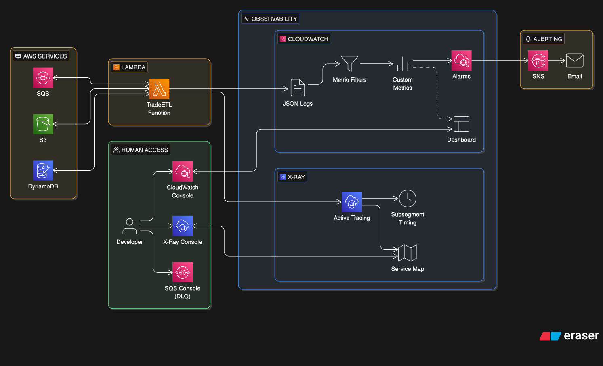

# Project 2 — Serverless ETL Pipeline with Observability

A serverless trade data processing pipeline on AWS, built to demonstrate event-driven architecture, data validation, idempotent processing, and a production-grade observability stack. Every component is deployed via AWS SAM (a CloudFormation superset) and updated through a GitHub Actions CI/CD pipeline using OIDC.

---

## Architecture Overview

Trade Processing Pipeline:


Observability:


---

## Key Design Decisions

### Why SAM instead of plain CloudFormation?

SAM is a superset of CloudFormation with shorthand for Lambda, API Gateway, and event source mappings. The `Transform: AWS::Serverless-2016-10-31` directive expands SAM syntax into standard CloudFormation before deployment. The Lambda function, its execution role, and the S3 event trigger are defined in roughly 30 lines of SAM versus ~100 lines of raw CloudFormation. Everything else in the template — DynamoDB, SQS, alarms, dashboard — uses standard CloudFormation resources. SAM also provides `sam build --use-container` which packages dependencies in a Lambda-compatible environment, and `sam local invoke` for local testing against the real SAM runtime.

### Idempotency design

S3 event notifications guarantee **at-least-once delivery** — the same event can arrive twice. Without an idempotency layer, a duplicate event would double-count every record in the file. The solution here is two-tiered:

1. **File-level idempotency**: Before processing begins, the Lambda writes `{bucket}/{key}#{etag}` to a separate DynamoDB table. If that key already exists, the invocation exits immediately. The ETag is included so that if the same key is re-uploaded with different content (new ETag), it is processed as a new file.

2. **Record-level idempotency**: DynamoDB `PutItem` uses a `ConditionExpression: attribute_not_exists(trade_id)`. If a record with the same `trade_id` already exists (possible if a file is partially processed before a crash), the write is silently skipped rather than overwriting.

### Metric Filters instead of custom metrics

The Lambda emits structured JSON log lines. CloudWatch Metric Filters parse those log events and extract numeric values as metrics. This means:
- Zero `PutMetricData` API calls inside the Lambda — reduced cost and latency
- The full metric schema is declared in the CloudFormation template and version-controlled
- Metrics are derived from actual log output, so they are always in sync with what the code logs

The trade-off is a small lag (~1 minute) between a log event and the metric appearing in CloudWatch. For a batch ETL pipeline, this is acceptable.

### DLQ strategy — two failure modes

The DLQ receives two categories of failures:

**Per-record validation failures** are sent explicitly by the Lambda code via `sqs.send_message`. Each DLQ message includes the raw CSV row, the validation error reason, the source S3 key, and the row number. Processing continues after a per-record failure — one bad row doesn't abort the file.

**Lambda invocation failures** (unrecoverable errors like S3 access denied, DynamoDB table not found, or unhandled exceptions) cause the Lambda to re-raise after logging. Lambda retries with exponential backoff (2 retries by default), then routes the failed invocation payload to the Lambda DLQ configuration. This means the DLQ receives both types of failure and a single alarm covers both.

### arm64 / Graviton2

Lambda on `arm64` is ~20% cheaper per GB-second than `x86_64` with equivalent or better performance for Python I/O-bound workloads. Both `aws_xray_sdk` and `boto3` have native arm64 wheels. SAM `--use-container` builds the Lambda in the correct architecture.

### DynamoDB TTL for cost control

Trade records expire after 90 days (set as a Unix epoch `ttl` attribute by the transformer). DynamoDB deletes expired items automatically, at no cost. Without TTL, a long-running pipeline would accumulate records indefinitely, increasing storage costs and read/write capacity usage.

---

## Validation Rules

Each CSV row is validated against 10 rules before being written to DynamoDB. Any failure routes the row to the DLQ with a specific reason code.

| Rule | Field | Condition |
|---|---|---|
| 1 | All fields | Required, non-empty |
| 2 | `trade_id` | UUID v4 format |
| 3 | `timestamp` | ISO 8601 UTC (`YYYY-MM-DDTHH:MM:SSZ`) |
| 4 | `symbol` | 2–5 uppercase letters |
| 5 | `side` | `BUY` or `SELL` (case-insensitive) |
| 6 | `quantity` | Positive integer, ≤ 1,000,000 |
| 7 | `price` | Positive float, ≤ 1,000,000, max 4 decimal places |
| 8 | `trader_id` | Alphanumeric, 4–20 characters |
| 9 | `venue` | One of: `LSE`, `NYSE`, `NASDAQ`, `BATS`, `CHI-X`, `DARK` |
| 10 | notional | `quantity × price > 0` |

---

## Mock Data

| File | Rows | Purpose |
|---|---|---|
| `mock-data/valid/trades_valid.csv` | 20 | Clean data across 6 symbols, 6 venues, mix of BUY/SELL |
| `mock-data/invalid/trades_missing_fields.csv` | 9 | One row per missing required field + multi-field missing |
| `mock-data/invalid/trades_invalid_values.csv` | 21 | One row per validation rule violation |
| `mock-data/invalid/trades_malformed.csv` | 7 | Wrong column count, whitespace-only rows, duplicate trade_id |

The invalid files are designed so that every row triggers a DLQ message. Upload them after the valid file to see the DLQ depth alarm fire, then inspect the DLQ messages to see the structured error payloads.

---

## Observability

### CloudWatch Dashboard

The dashboard (`trade-etl-pipeline-{env}`) shows:
- Records valid / invalid (single-value tiles with alarm thresholds)
- DLQ depth (fires red above 0)
- Valid vs invalid time series (5-min periods)
- Lambda duration p50/p95/p99 with 45s alert threshold
- Lambda invocations and errors
- File processing duration p95

### Custom Metrics (namespace: `TradeETL/{environment}`)

| Metric | Source log event | Description |
|---|---|---|
| `RecordsValid` | `record_processed` | Successfully written to DynamoDB |
| `RecordsInvalid` | `record_sent_to_dlq` | Failed validation, sent to DLQ |
| `ProcessingDurationMs` | `file_processing_complete` | End-to-end file processing time |
| `DynamoDBErrors` | `dynamodb_write_failed` | DynamoDB write failures |
| `DuplicatesSkipped` | `object_already_processed` | Idempotency working correctly |

### Alarms

| Alarm | Threshold | Meaning |
|---|---|---|
| `dlq-depth` | DLQ depth > 0 | At least one record failed |
| `lambda-errors` | Errors ≥ 1 in 5 min | Invocation-level failure |
| `lambda-duration` | p95 duration > 45s | Risk of timeout on large files |
| `high-invalid-rate` | > 20 invalid records in 5 min | Data quality issue upstream |

### X-Ray

X-Ray active tracing is enabled on the Lambda function. Custom subsegments wrap the S3 read, the validation loop, and each DynamoDB write, so the X-Ray service map shows timing breakdowns per operation. Navigate to **X-Ray -> Traces** in the AWS console after processing a file.

---

## Running the Pipeline

### Demo sequence (after deployment)

```bash
# 1. Upload valid data — watch Dashboard for RecordsValid to increment
make upload-valid

# 2. Tail logs to see structured JSON output in real time
make tail-logs

# 3. Upload invalid data — DLQ depth alarm should fire
make upload-all-invalid

# 4. Inspect DLQ messages to see failure payloads
make check-dlq

# 5. Upload the valid file again — idempotency should skip it
make upload-valid
# -> Logs will show: "object_already_processed"
```

### Local testing with SAM CLI

`sam local invoke` runs the Lambda handler inside a local Docker container that emulates the Lambda runtime (Python 3.12, arm64). The handler code executes locally, but it still calls **real AWS services** — S3 to read the CSV, DynamoDB to write records, and SQS for DLQ messages. You need a deployed stack and valid AWS credentials in your shell.

**Prerequisites**

- Docker running locally (`docker info` should succeed)
- Stack deployed (`make deploy`) so the real tables and queue exist
- AWS credentials in your environment (SSO session or static keys)

**Step 1 — Get the real values from the deployed stack**

```bash
make outputs
```

Note the `DLQUrl`, `TradesTableName`, and `RawUploadsBucketName` values.

**Step 2 — Upload the CSV you want to test with**

The Lambda reads the CSV from S3, so the file referenced in the event must already be in the bucket:

```bash
make upload-valid
# or for invalid data:
make upload-invalid-values
```

Note the exact S3 key printed by the upload command (e.g. `uploads/trades_valid_20260331_054809.csv`).

**Step 3 — Update the event file**

Edit `events/s3_put_event.json` to point at your real bucket and the key you just uploaded:

```json
{
  "Records": [
    {
      ...
      "s3": {
        "bucket": {
          "name": "123456789012-trade-etl-pipeline-raw-uploads"
        },
        "object": {
          "key": "uploads/trades_valid_20240315_093100.csv",
          "eTag": "any-string-here"
        }
      }
    }
  ]
}
```

**Step 4 — Create `local-env.json`** (git-ignored — do not commit)

Paste the real values from `make outputs`:

```json
{
  "TradeProcessorFunction": {
    "DYNAMODB_TABLE_NAME":    "trade-etl-pipeline-trades",
    "IDEMPOTENCY_TABLE_NAME": "trade-etl-pipeline-idempotency",
    "DLQ_URL":                "https://sqs.us-east-1.amazonaws.com/123456789012/trade-etl-pipeline-dlq",
    "ENVIRONMENT":            "dev"
  }
}
```

**Step 5 — Build, then run**

`sam local invoke` mounts your source directory as-is — it does not install dependencies automatically. You must build first so that third-party packages (`aws_xray_sdk`, `boto3`, etc.) are bundled into `.aws-sam/build/`:

```bash
sam build --template infrastructure/template.yaml

sam local invoke TradeProcessorFunction \
  --template .aws-sam/build/template.yaml \
  --event events/s3_put_event.json \
  --env-vars local-env.json
```

SAM pulls the Lambda Docker image on first run (slow), then executes the handler and prints its structured JSON logs and return value to stdout. The invocation writes real records to DynamoDB and sends real DLQ messages — treat it the same as a live invocation.

> **Note on idempotency:** if you invoke with the same event file twice, the second run will log `object_already_processed` and skip all records. Change the `eTag` value in `events/s3_put_event.json` to force reprocessing.

---

## Cost Estimate

| Service | Usage assumption | Monthly cost (approx.) |
|---|---|---|
| Lambda | < 100 invocations, 256 MB, < 10s avg | Free tier |
| S3 | < 100 MB storage, < 10,000 requests | < $0.01 |
| DynamoDB | On-demand, < 1M read/write units | Free tier |
| SQS | < 1M messages | Free tier |
| CloudWatch Metrics | 5 custom metrics | ~$0.50 |
| CloudWatch Alarms | 4 alarms | ~$0.40 |
| CloudWatch Dashboard | 1 dashboard | ~$3.00 |
| X-Ray | < 100k traces | Free tier |
| SNS | < 1000 email notifications | Free tier |
| **Total** | | **~$4 / month** |

The dominant cost is the CloudWatch Dashboard ($3/month). Remove it with `DashboardEnabled: false` if cost is a concern — alarms and metrics remain functional.

---

## Deployment

### Prerequisites

- AWS SAM CLI: `pip install aws-sam-cli`
- OIDC bootstrap deployed
- GitHub secrets: `AWS_ROLE_ARN`, `ALERT_EMAIL`

### Deploy

```bash
make deploy ALERT_EMAIL=you@example.com ENVIRONMENT=dev
```

First deploy takes ~3 minutes. You'll receive an SNS subscription confirmation email — confirm it to receive alarm notifications.

### Teardown

```bash
make destroy
```

The `TradesTable` has `DeletionPolicy: Retain` — processed trade data is preserved. Delete it manually via console or CLI if you want a full cleanup.
